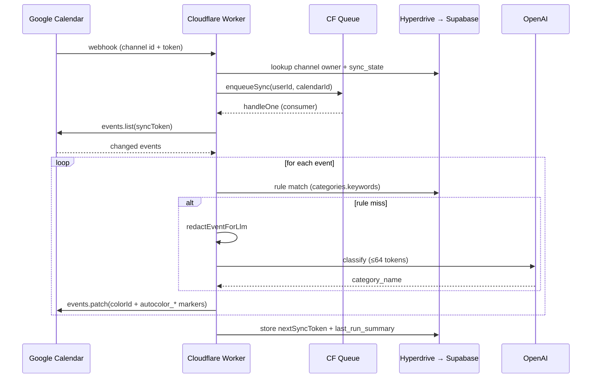

# AutoColor for Calendar

**AutoColor for Calendar** automatically assigns colors to Google Calendar
events based on user-defined semantic rules or contextual analysis. It is a
multi-tenant SaaS application for the Google Workspace Marketplace that
leverages a Serverless backend (Cloudflare Workers) and a 2-stage
classification engine (Rule → LLM) with mandatory PII redaction before any
LLM call.

## Repository layout

- [`docs/`](docs/) — Architectural documentation, UI plans, runbooks.
- [`gas/`](gas/) — Google Workspace Add-on UI (CardService).
- [`src/`](src/) — Cloudflare Workers backend (Hono routes, queues, services, DB).
- [`drizzle/`](drizzle/) — Postgres schema migrations (drizzle-kit + RLS).
- [`scripts/`](scripts/) — Operator-side scripts (secrets, failure simulator).

## Sync flow at a glance



Edges are direction-only. The authoritative invariants
(idempotency, color-ownership marker, halt-on-failure, watch-renewal lock,
token rotation) live in [`docs/architecture-guidelines.md`](docs/architecture-guidelines.md)
and [`src/CLAUDE.md`](src/CLAUDE.md).

## Start here

1. [`docs/project-overview.md`](docs/project-overview.md) — application + architecture overview.
2. [`docs/architecture-guidelines.md`](docs/architecture-guidelines.md) — core architectural rules, sync flows, Add-on constraints.
3. [`docs/ARCHITECTURE.md`](docs/ARCHITECTURE.md) — module map + cross-module dependency diagram.
4. [`CLAUDE.md`](CLAUDE.md) — entry point for Claude Code (module index + quick commands).
5. [`gas/README.md`](gas/README.md) — Apps Script Add-on setup.

## Self-checks

```bash
pnpm test                                      # vitest
pnpm typecheck                                 # tsc --noEmit
pnpm lint                                      # eslint
python3 scripts/check-context-paths.py         # CLAUDE.md / README.md path validation (CI gate)
```
