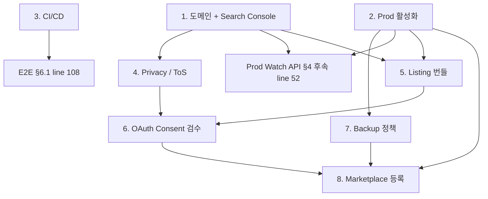

# Completion Roadmap

AutoColor for Calendar를 **Workspace Marketplace public listing 활성** 상태까지
끌어올리는 데 필요한 잔여 작업의 **의존성 순서** 가이드. 항목 자체의 정본은
[`TODO.md`](../TODO.md) (코드/인프라 단위) 와
[`marketplace-readiness.md`](marketplace-readiness.md) (제출 자료/검수 surface)
이며, 이 문서는 그 항목들 사이의 unblock 관계만 표시한다. 항목이 닫힐 때마다
이 문서를 수정할 필요는 없다 — 의존성 구조가 바뀔 때만 갱신.

## 완성 정의

다음 **세 조건이 동시에** 충족된 상태:

1. **Public listing 활성** — Workspace Marketplace에서 일반 사용자가 검색·설치 가능.
2. **Prod 백엔드 활성** — `autocolor-prod` Worker가 실제 OAuth/DB 트래픽을 처리.
   (현재: URL-reserving shell — [`src/CLAUDE.md` "Environments"](../src/CLAUDE.md).)
3. **OAuth verification 완료** — Google Restricted Scope 검수 통과
   (스코프 정당화 + 데모 영상 + Privacy/ToS).

하나만 빠져도 "출시"가 아니다.

## Critical path

직렬 의존이 강한 순서. 위에서부터 진행 권장.

### 1. 도메인 확보 + Search Console 인증

- 정본: [`TODO.md` line 8](../TODO.md), [Launch Gate row 1](marketplace-readiness.md#status).
- **단일 최대 unblock 지점.** Privacy URL · ToS URL · App home URL · Support URL ·
  prod Watch API `WEBHOOK_BASE_URL` (§4 후속 line 52)이 전부 이 게이트를 공유.
- 후속 unblock: §4 (Privacy/ToS), §5 (listing), §1.5 (support email/URL row 78-79).

### 2. Prod 환경 활성화

- 정본: [`TODO.md` §3 후속 line 35](../TODO.md), [Launch Gate row 2](marketplace-readiness.md#status).
- 작업 단위는 line 35에 명시 — Supabase prod, GCP prod OAuth client, secrets 6종,
  Hyperdrive 바인딩, GAS prod `/exec` 매핑.
- 검증: `/healthz` · `/oauth/google/callback` · `/me` 세 엔드포인트 prod에서 200.
- 게이트 1과 **부분 병행 가능**. 단 prod Watch API는 도메인 verified까지 OFF.
- **세션 GC** ([`TODO.md` §3 후속 line 38](../TODO.md))는 prod 활성화 직후
  pg_cron으로 즉시 스케줄 — Retention 정책 (`marketplace-readiness.md` row 178)
  unblock 조건.

### 3. CI/CD 파이프라인

- 정본: [`TODO.md` §7 line 129](../TODO.md).
- **§6.1 E2E 테스트의 선행조건**(line 108에 명시).
- 최소 단위: `pnpm vitest run` + `pnpm typecheck` + `pnpm lint` GitHub Actions PR gate.
- 권장 추가: `pnpm db:generate` migration drift 검출, 보호 브랜치 정책.

### 4. Privacy Policy + Terms of Service

- 정본: [`TODO.md` §7 line 132](../TODO.md), [`marketplace-readiness.md` §2 row 121-122](marketplace-readiness.md).
- Legal 작업 — 외부 의존성이 가장 큼. **게이트 1과 동시 시작 권장.**
- 본문 작성 → 도메인에 호스팅 → URL을 marketplace-readiness §2에 기록.

### 5. Marketplace listing 자료 번들

- 정본: [`marketplace-readiness.md` §1](marketplace-readiness.md) (`미작성` 11건).
- 짧은/긴 description (KR+EN), 아이콘 128/32, 스크린샷 ≥3, (선택) 홍보 영상,
  카테고리, support email/URL.
- 최종 스크린샷은 게이트 2(prod 활성화) 이후 촬영.

### 6. OAuth Consent Screen + Restricted Scope 검수

- 정본: [`TODO.md` §7 line 131](../TODO.md), [`marketplace-readiness.md` §2 row 126-130](marketplace-readiness.md).
- 입력: scope justifications (현 `초안`), 제한 스코프 데모 영상, Privacy URL, ToS URL.
- 게이트 4·5(부분) 충족 후 제출 가능.
- **Google 측 검수 통상 4-6주** — critical path의 최장 비-코드 구간.

### 7. 백업/복구 정책

- 정본: [`TODO.md` §7 line 130](../TODO.md).
- Supabase PITR 설정 + 복구 리허설 절차 문서화.
- 게이트 2 직후가 가장 저렴 — 데이터가 쌓이기 전.

### 8. Marketplace 등록 제출

- 정본: [`TODO.md` §7 line 132](../TODO.md).
- 게이트 1·2·4·5·6·7 모두 충족 후 제출.
- Google admin 검수 통상 1-3주.

## 비-Critical Path (병행 / 후순위)

| 항목 | 정본 | 메모 |
|---|---|---|
| 테스트 보강 §6.1 | [`TODO.md` line 104-108`](../TODO.md) | 게이트 3(CI) 들어오면 자연 동행 |
| 통합 테스트 하네스 §6.2 | [`TODO.md` line 112-113`](../TODO.md) | postgres-in-container 도입; 단독 작업 |
| Rate limit 통합 §6.4 | [`TODO.md` line 123`](../TODO.md) | 트래픽 증가 전까지 후순위 |
| 팀/공유 캘린더 ownership §5 후속 | [`TODO.md` line 98`](../TODO.md) | 설계 선행; 코드 직진 불가 |
| GAS UX — 와이어프레임 / 별도 Web UI | [`TODO.md` line 6, 16`](../TODO.md) | line 16은 사용자 명시 후순위 |
| Onboarding card 카피 refresh | [`marketplace-readiness.md` §2 row 131](marketplace-readiness.md) | 게이트 4 (Privacy URL) 후 |
| CASA 보안 평가 | [`marketplace-readiness.md` §2 row 130](marketplace-readiness.md) | Google 요청 시에만 발동 |

## 의존성 그래프

## 권장 실행 순서

1. **게이트 1·2·4를 동시 착수** — 외부 의존성(도메인 등록 대기, prod Supabase
   프로비저닝 시간, Legal 작성 시간)이 각각 며칠~몇 주 단위라 직렬화하면 시간
   낭비. 1·2는 운영(Ops), 4는 Legal로 owner가 다르므로 충돌 적음.
2. **게이트 3(CI/CD)는 1·2와 별개로 코드 머지 직전에** — 외부 의존성 0, 즉시
   가능. §6.1 E2E를 풀려면 이 게이트가 우선이지만 §6.1 자체는 비-critical.
3. **게이트 5(listing assets)는 게이트 2 검증 직후** — 스크린샷이 prod에서
   찍혀야 신뢰성 있음.
4. **게이트 6(OAuth verification) 제출 ≪ 검수 통과** 사이의 4-6주는 게이트 7과
   §6.1·§6.2 보강에 사용.
5. **게이트 8(Marketplace 등록) 제출 ≪ 통과** 사이의 1-3주에 운영 모니터링
   대시보드 (`/api/stats` 기반) 정착.

## 상태 추적

- [`TODO.md`](../TODO.md) 체크박스 = 단위 작업 정본.
- [`marketplace-readiness.md` §5 Launch Gates](marketplace-readiness.md#status) =
  검수 surface 단위 정본. 이 문서의 critical-path 번호와 1:1 대응 아님 — 이 문서는
  의존성 순서, Launch Gates는 surface 단위 freshness.
- 이 문서는 **목록 정본 아님.** 항목이 닫혀도 여기는 수정 불필요.
